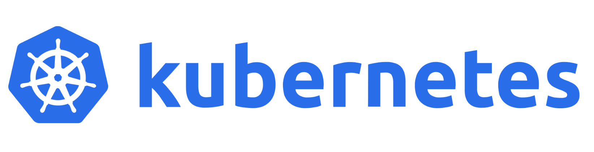

# kubernetes-cookbook

## What is Kubernetes?
[Kubernetes](https://kubernetes.io/docs/concepts/overview/) is a portable, extensible, open source platform for managing containerized workloads and services, that facilitates both declarative configuration and automation.

Kubernetes assembles one or more computers, either virtual machines or bare metal, into a cluster which can run workloads in containers. It works with various container runtimes, such as [containerd](https://containerd.io/) and [CRI-O](https://cri-o.io/). Its suitability for running and managing workloads of all sizes and styles has led to its widespread adoption in clouds and data centers. There are multiple distributions of this platform – from independent software vendors (ISVs) as well as hosted-on-cloud offerings from all the major public cloud vendors.

Kubernetes is one of the most widely deployed software systems in the world being used across companies including Google, Microsoft, Cisco, Amazon, Apple, Meta, Nvidia, Reddit and Pinterest.

## Cookbook

- [Use External Secrets Operator (ESO) to Store and Use Sensitive Data in Kubernetes Cluster](./recipes/external-operator-with-aws-secrets-manager/)
- [RBAC Basics](./recipes/rbac-basics/)
- [Scaling Kubernetes Workloads: How Metrics Server and HPA Work Together](./recipes/metrics-server/)
- [Init Container Basics](./recipes/init-containers/basics/)