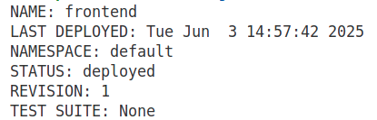
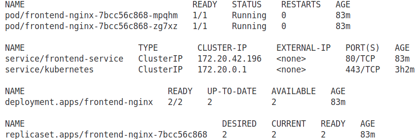
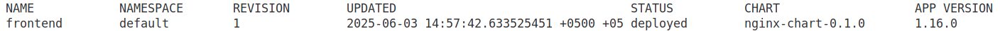

# Helm Charts Basics: Write Helm Chart

This demo project shows the basics of using Helm Charts with app development. In particular, it shows how to develop Helm Chart structure for basic Nginx deployment on Kubernetes cluster.

## Table of Contents

- [Helm Charts Basics: Write Helm Chart](#helm-charts-basics-write-helm-chart)
  - [Overview](#overview)
  - [Why Use Helm Instead of Manual YAML or Scripting](#why-use-helm-instead-of-manual-yaml-or-scripting)
  - [Typical Use Cases for Helm](#typical-use-cases-for-helm)
    - [1. Multi-environment Deployments](#1-multi-environment-deployments)
    - [2. Reusable Deployments](#2-reusable-deployments)
    - [3. Versioned Releases and Rollbacks](#3-versioned-releases-and-rollbacks)
    - [4. Parameterization & Config Management](#4-parameterization--config-management)
    - [5. CI/CD Integration](#5-cicd-integration)
  - [Best Practice Tip](#best-practice-tip)
  - [Considerations and Trade-Offs](#considerations-and-trade-offs)
- [Workshop](#workshop)
  - [Create Nginx Helm Chart](#create-nginx-helm-chart)
  - [Chart.yaml](#chartyaml)
  - [values.yaml](#valuesyaml)
  - [templates/](#templates)
  - [charts/](#charts)
- [Summary](#summary)
- [Edit Chart.yaml file](#edit-chartyaml-file)
- [Delete default templates](#delete-default-templates)
- [Helm Objects](#helm-objects)
  - [Release](#release)
  - [Chart](#chart)
  - [Values](#values)
- [Identifying What to Templatize in Helm](#identifying-what-to-templatize-in-helm)
  - [Key Template Fields Explained](#key-template-fields-explained)
- [Create a Deployment Template](#create-a-deployment-template)
- [Helm Chart Validation](#helm-chart-validation)
- [Deploy App](#deploy-app)
- [Helm Upgrade](#helm-upgrade)
- [Helm Rollback](#helm-rollback)
- [Helm Package](#helm-package)
- [Best Practices](#best-practices)
  - [Best Practices for Developing Helm Charts](#best-practices-for-developing-helm-charts)
- [References](#references)

## Overview

[Helm](https://helm.sh/) is one of the most effective tools for managing Kubernetes manifests, especially when dealing with **multi-environment deployments**.

---

## **Why Use Helm Instead of Manual YAML or Scripting**

| Feature                     | Manual YAML Files               | Shell/Python Scripts       | **Helm**                           |
| --------------------------- | ------------------------------- | -------------------------- | ---------------------------------- |
| Environment-specific values | Multiple files or complex logic | Hardcoded or fragile logic | Handled via `values.yaml`          |
| Reusability                 | Low                             | Moderate                   | High                               |
| Templating                  | Manual                          | Scripted                   | Built-in with [Go templates](https://pkg.go.dev/text/template)         |
| Scalability                 | Poor as environments grow       | Poor to moderate           | Excellent                          |
| Community and ecosystem     | N/A                             | N/A                        | Rich ecosystem of charts & plugins |
| CI/CD compatibility         | Manual integration needed       | Custom scripting           | Seamless via `helm upgrade`        |

---

## **Typical Use Cases for Helm**

### 1. **Multi-environment Deployments**

Let's imagine we have four environments, `dev`, `qa`, `staging`, `prod` – each environment has unique config like:

* Replicas count
* HPA values
* Secrets and configmaps
* Ingress paths or domains

Helm solves this cleanly:

```bash
helm upgrade --install my-nginx ./nginx-chart -f values-dev.yaml
```

Each environment specific Helm Chart deployment will have its own set of values.

### 2. **Reusable Deployments**

Want to deploy Nginx, Redis, or your own app in different clusters or namespaces? Helm makes it reusable via templates.

### 3. **Versioned Releases and Rollbacks**

You get built-in revision history. If something breaks in `prod`, just:

```bash
helm rollback my-app 3
```

### 4. **Parameterization & Config Management**

Instead of editing 10 YAML files, just change values in `values.yaml`. Everything else stays untouched.

### 5. **CI/CD Integration**

Use Helm with GitOps or CI/CD tools (e.g., Argo CD, GitLab CI, Jenkins) for clean, parameterized deployments.

---

## Best Practice Tip

Structure your Helm chart with a clear directory structure:

```
nginx-chart/
├── Chart.yaml
├── values.yaml
├── templates/
│   ├── deployment.yaml
│   ├── service.yaml
│   ├── ingress.yaml
```

Then provide overrides:

* `values-dev.yaml`
* `values-prod.yaml`
* etc.

---

Helm shines when:

* You want to manage the complexity of deploying apps in multiple environments
* You aim to reuse code and minimize duplication
* You want to integrate with CI/CD pipelines cleanly

It's much better than scripts or copy-pasting YAML files.

## Considerations and Trade-Offs

While Helm is powerful, it’s worth noting some considerations:

- **Learning Curve**: Helm’s templating syntax (based on Go templates) can be complex for beginners, especially for intricate charts.
- **Chart Maintenance**: Poorly designed charts can become hard to maintain. It’s important to follow best practices, like keeping templates modular and well-documented.
- **Alternatives**: Tools like [Kustomize](https://kustomize.io/) or plain Kubernetes YAML files can be a good fit for simple deployments. Kustomize is useful when you want to reuse a common configuration and apply environment-specific changes - called *overlays* - without using templates. However, it doesn’t support advanced features like Helm’s built-in dependency management or the ability to track release history.
- **Security**: Helm charts pulling from public repositories or using untrusted values files can introduce security risks. Always validate and secure chart sources and configurations.

## Workshop

### Create Nginx Helm Chart

To create Helm Chart boilerplate files:
```bash
helm create nginx-chart
```

This command will create the following folders and files:
```bash
.
├── charts
├── Chart.yaml
├── templates
│   ├── deployment.yaml
│   ├── _helpers.tpl
│   ├── hpa.yaml
│   ├── ingress.yaml
│   ├── NOTES.txt
│   ├── serviceaccount.yaml
│   ├── service.yaml
│   └── tests
│       └── test-connection.yaml
└── values.yaml
```

The command `helm create nginx-chart` scaffolds a basic Helm chart structure for deploying an app (in this case, `nginx-chart`).

### `Chart.yaml`

Defines metadata about the Helm chart:

```yaml
name: nginx-chart
version: 0.1.0
apiVersion: v2
description: A Helm chart for Kubernetes
```

* It’s like a `package.json` for the chart.
* Required fields: `name`, `version`, `apiVersion`.

---

### `values.yaml`

Default configuration values for templates.

```yaml
replicaCount: 1
image:
  repository: nginx
  tag: latest
```

* You can override these with `-f my-values.yaml`.
* Templates use these values via syntax like `{{ .Values.image.repository }}`.

---

### `templates/`

Contains Kubernetes manifest templates that Helm renders using Go templating.

#### `deployment.yaml`

Defines a `Deployment` resource using values from `values.yaml`.

#### `service.yaml`

Defines a `Service` to expose your app.

#### `ingress.yaml`

Defines optional `Ingress` resource to expose the service externally.

#### `hpa.yaml`

Defines optional `HorizontalPodAutoscaler` for autoscaling based on CPU/memory.

#### `serviceaccount.yaml`

Creates a `ServiceAccount` for your pods if needed.

#### `_helpers.tpl`

Contains helper template functions (e.g., name formatting, labels).

```tpl
{{/* Generate a full name for the release */}}
{{- define "nginx-chart.fullname" -}}
{{ .Release.Name }}-{{ .Chart.Name }}
{{- end }}
```

#### `NOTES.txt`

Optional notes shown after a successful install/upgrade:

```txt
1. Get the application URL by running:
   export POD_NAME=$(kubectl get pods ...)
```

#### `tests/test-connection.yaml`

A test `Pod` definition used by `helm test` to verify the release is working.

---

### `charts/`

A place to put dependent charts if you're using [chart dependencies](https://helm.sh/docs/helm/helm_dependency/). Empty by default.

---

## Summary

| File/Folder                  | Purpose                               |
| ---------------------------- | ------------------------------------- |
| `Chart.yaml`                 | Chart metadata                        |
| `values.yaml`                | Default values for template rendering |
| `templates/*.yaml`           | Kubernetes resource templates         |
| `_helpers.tpl`               | Custom helper functions/macros        |
| `NOTES.txt`                  | Post-install instructions             |
| `charts/`                    | Subcharts (dependencies)              |
| `tests/test-connection.yaml` | Helm test pod to check connectivity   |

## Edit Chart.yaml file

Edit the `Chart.yaml` file with your own data:
```yaml
apiVersion: v2 # Chart API version. v2 is for Helm 3 and v1 is for previous versions.
name: nginx-chart # Name of the chart
description: A Helm chart for Nginx

# A chart can be either an 'application' or a 'library' chart.
#
# Application charts are a collection of templates that can be packaged into versioned archives
# to be deployed.
#
# Library charts provide useful utilities or functions for the chart developer. They're included as
# a dependency of application charts to inject those utilities and functions into the rendering
# pipeline. Library charts do not define any templates and therefore cannot be deployed.
type: application

# This is the chart version. This version number should be incremented each time you make changes
# to the chart and its templates, including the app version.
# Versions are expected to follow Semantic Versioning (https://semver.org/)
version: 0.1.0

# This is the version number of the application being deployed. This version number should be
# incremented each time you make changes to the application. Versions are not expected to
# follow Semantic Versioning. They should reflect the version the application is using.
# It is recommended to use it with quotes.
appVersion: "1.16.0"

# Information about the owner of the chart
maintainers:
  - name: Maxat Akbanov
    email: mail@maxat-akbanov.com
```

## Delete default templates

We don't need default template files. Hence, delete them:
```bash
rm -rf templates/*
```

Create `deployment.yaml`:
```yaml
apiVersion: apps/v1
kind: Deployment
metadata:
  name: release-name-nginx
  labels:
    app: nginx
spec:
  replicas: 1
  selector:
    matchLabels:
      app: nginx
  template:
    metadata:
      labels:
        app: nginx
    spec:
      containers:
        - name: nginx-chart
          image: "nginx:1.16.0"
          imagePullPolicy: IfNotPresent
          ports:
            - name: http
              containerPort: 80
              protocol: TCP
          volumeMounts:
            - name: nginx-index-file
              mountPath: /usr/share/nginx/html/
      volumes:
        - name: nginx-index-file
          configMap:
            name: index-html-configmap
```

Now, to parametrize this file we need to use Go templating syntax:
```bash
{{ .Object.Parameter }}
```

## Helm Objects

Before working with Helm templates, it's important to understand what **template objects** are. In this example, we’ll focus on three commonly used objects:

---

### `Release`

* This object contains information about the current Helm release.
* Every time you install a chart, Helm assigns it a **release name**.
* You can access values like the release name, namespace, and more using the `Release` object.
* **Example:**
  `{{ .Release.Name }}` --> returns the release name (e.g., `nginx-dev`)

---

### `Chart`

* This object refers to data from the `Chart.yaml` file.
* It lets you access metadata such as the chart name, version, or description.
* **Example:**
  `{{ .Chart.Name }}` --> returns the chart’s name
  `{{ .Chart.Version }}` --> returns the chart version

---

### `Values`

* This is the most used object in templates.
* It gives you access to everything defined in your `values.yaml` file.
* You can customize your deployments by referencing these values.
* **Example:**
  If `values.yaml` contains:

  ```yaml
  image:
    repository: nginx
  ```

  then in a template you can write:
  `{{ .Values.image.repository }}`


To learn more, see [Helm Built-in Objects](https://helm.sh/docs/chart_template_guide/builtin_objects/)

## Identifying What to Templatize in Helm

Before writing Helm templates, it's important to determine which parts of the Kubernetes manifest may vary between environments or releases. In this example, the following fields will be templatized: **deployment name**, **replica count**, **container name**, **image**, **image pull policy**, and **ConfigMap name**.

---

### Key Template Fields Explained

* **Deployment Name:**

  ```yaml
  name: {{ .Release.Name }}-nginx
  ```

  Helm requires each release to have a unique name. To ensure the deployment name is also unique, it is templated using the release name with `-nginx` appended. For example, if the release name is `frontend`, the resulting deployment name will be `frontend-nginx`.

* **Container Name:**

  ```yaml
  name: {{ .Chart.Name }}
  ```

  The container name is templated using the `Chart` object, pulling the chart name from `Chart.yaml`.

* **Replica Count:**

  ```yaml
  replicas: {{ .Values.replicaCount }}
  ```

  The number of replicas is defined in `values.yaml` and accessed using the `Values` object, allowing it to be easily overridden per environment.

* **Image Definition:**

  ```yaml
  image: "{{ .Values.image.repository }}:{{ .Values.image.tag }}"
  ```

  The image is dynamically constructed using both the `repository` and `tag` fields from `values.yaml`. Multiple template expressions are used on the same line.

* **ConfigMap Name:**

  ```yaml
  configMapRef:
    name: {{ .Release.Name }}-index-html-configmap
  ```

  Similar to the deployment name, the ConfigMap name includes the release name to ensure uniqueness and clarity across environments.

## Create a Deployment Template

The `deployment.yaml` file after applying templates:
```yaml
apiVersion: apps/v1
kind: Deployment
metadata:
  name: {{ .Release.Name }}-nginx
  labels:
    app: nginx
spec:
  replicas: {{ .Values.replicaCount }}
  selector:
    matchLabels:
      app: nginx
  template:
    metadata:
      labels:
        app: nginx
    spec:
      containers:
        - name: {{ .Chart.Name }}
          image: "{{ .Values.image.repository }}:{{ .Values.image.tag }}"
          imagePullPolicy: {{ .Values.image.pullPolicy }}
          ports:
            - name: http
              containerPort: 80
              protocol: TCP
          volumeMounts:
            - name: nginx-index-file
              mountPath: /usr/share/nginx/html/
      volumes:
        - name: nginx-index-file
          configMap:
            name: {{ .Release.Name }}-index-html-configmap
```

Next templatize and create the following files:
- `service.yaml`
- `configmap.yaml`
- `values.yaml`

After these changes, directory structure should look like this:
```bash
.
├── charts
├── Chart.yaml
├── templates
│   ├── configmap.yaml
│   ├── deployment.yaml
│   └── service.yaml
└── values.yaml
```

## Helm Chart Validation

To make sure that charts are valid and, all the indentations are fine, run at the root of the Helm chart:
```bash
helm lint .
```

To validate if the values are getting substituted in the templates, you can render the templated YAML files with the values using the following command. It will generate and display all the manifest files with the substituted values:
```bash
helm template .
```

We can also use `--dry-run` command to check. This will pretend to install the chart to the cluster and if there is some issue it will show the error:
```bash
helm install --dry-run my-release nginx-chart
```

To output the release values installed to the cluster:
```bash
helm get values
```

To output the manifests that are running in the cluster:
```bash
helm get manifest [RELEASE_NAME]
```

To output the differences between the two revisions:
```bash
helm diff revision nginx-chart 1 2
```

## Deploy App

To deploy frontend Nginx app:
```bash
helm install frontend nginx-chart
```



To see all app related services:
```bash
kubectl get all -n default
```



To check the installed Helm releases in all namespaces:
```bash
helm list -A
```



To get Kubernetes objects info:
```bash
kubectl get deployment
kubectl get services
kubectl get configmap
kubectl get pods
```

To install app into different environment use subsequent `values.yaml` file:
```bash
helm install frontend nginx-chart --values env/prod-values.yaml
```

When you have Helm as part of your CI/CD pipeline, you can write custom logic to pass the required values file depending on the environment.

## Helm Upgrade

The `helm upgrade` command is used to **update an existing Helm release** with new configuration, chart changes, or even a new chart version. It’s like deploying a new version of your app without uninstalling the previous one.

---

### Basic Syntax

```bash
helm upgrade RELEASE_NAME CHART [flags]
```

Where:

* `RELEASE_NAME` --> the name of your existing Helm release (e.g., `frontend`)
* `CHART` --> the chart path (e.g., `./nginx-chart`) or repo-based chart name
* `[flags]` --> additional options (like `--values`, `--set`, etc.)

---

### Common Use Case

Update an app with modified config:

```bash
helm upgrade frontend ./nginx-chart --values env/prod-values.yaml
```

This will:

* Keep the **same release name** (`frontend`)
* Use updated templates or values
* Roll out changes to your Kubernetes cluster

---

### Useful Flags

| Flag             | Description                                                           |
| ---------------- | --------------------------------------------------------------------- |
| `--values, -f`   | Use a specific `values.yaml` file                                     |
| `--set`          | Override a value inline (`--set image.tag=1.25.0`)                    |
| `--install`      | If the release doesn't exist, create it (useful for idempotent CI/CD) |
| `--atomic`       | Roll back automatically if the upgrade fails                          |
| `--dry-run`      | Show what would change without applying it                            |
| `--reuse-values` | Keep existing values and apply only the new ones you provide          |
| `--timeout`      | Specifies how long Helm should wait for the Kubernetes resources to become ready before considering the upgrade failed. |

---

### Example with Safe Deployment

```bash
helm upgrade frontend ./nginx-chart \
  --values env/staging-values.yaml \
  --atomic \
  --timeout 2m
```

* Updates release `frontend` with new values
* Automatically rolls back if something goes wrong
* Waits up to 2 minutes for the upgrade to complete

For more information, see [Helm Upgrade](https://helm.sh/docs/helm/helm_upgrade/)

## Helm Rollback

The `helm rollback` command is used to **revert a Helm release to a previous version**. It’s useful when an upgrade causes issues and you need to quickly return to a known good state.

---

### **What It Does**

* Rolls back your **Kubernetes resources** (e.g., Deployments, Services, ConfigMaps) to the configuration of a previous successful release.
* Keeps track of **release revisions** (version history).
* You can roll back to any previous revision, not just the one before the current.

---

### **Syntax**

```bash
helm rollback RELEASE [REVISION] [flags]
```

* `RELEASE` --> the name of the Helm release (e.g., `frontend`)
* `REVISION` --> the revision number to roll back to (optional, defaults to previous)

---

### **Example Usage**

#### 1. Roll back to the previous version:

```bash
helm rollback frontend
```

#### 2. Roll back to a specific revision (e.g., version 2):

```bash
helm rollback frontend 2
```

---

### **How to View Available Revisions**

To list all revisions of a release:

```bash
helm history frontend
```

Output:

```
REVISION    UPDATED                     STATUS      CHART            APP VERSION    DESCRIPTION
1           2024-06-01 12:00:00         deployed    nginx-chart-0.1.0 1.16.0         Install complete
2           2024-06-04 13:30:00         failed      nginx-chart-0.1.0 1.25.0         Upgrade failed
3           2024-06-04 13:35:00         deployed    nginx-chart-0.1.0 1.16.0         Rollback to 1
```

---

### **Common Flags**

| Flag        | Purpose                                                               |
| ----------- | --------------------------------------------------------------------- |
| `--dry-run` | Simulates the rollback without actually applying it                   |
| `--wait`    | Waits until all resources are in a ready state before completing      |
| `--timeout` | Sets a max duration for the rollback operation (e.g., `--timeout 2m`) |

---

### Safety Tip

Combine `--wait` and `--timeout` to ensure rollback stability:

```bash
helm rollback frontend 1 --wait --timeout 2m
```

## Helm Package

The `helm package` command is used to **create a `.tgz` archive of your chart directory**, making it easy to share, store, or publish the chart.

---

### **What It Does**

It bundles your Helm chart (e.g., `nginx-chart/`) into a compressed tarball like:

```
nginx-chart-0.1.0.tgz
```

This archive includes:

* `Chart.yaml`
* `values.yaml`
* All files in the `templates/` folder
* Any subcharts or dependencies in `charts/`

---

### **Basic Syntax**

```bash
helm package [CHART_PATH] [flags]
```

* `[CHART_PATH]` – path to your chart directory (e.g., `./nginx-chart`)

---

### **Example**

```bash
helm package ./nginx-chart
```

Output:

```
Successfully packaged chart and saved it to: /your/path/nginx-chart-0.1.0.tgz
```

---

### **Useful Flags**

| Flag            | Description                                                      |
| --------------- | ---------------------------------------------------------------- |
| `--destination` | Directory to save the `.tgz` file (default is current directory) |
| `--version`     | Override the chart version temporarily for packaging             |
| `--app-version` | Override `appVersion` in `Chart.yaml` during packaging           |

Example with custom version:

```bash
helm package ./nginx-chart --version 1.0.1 --destination ./charts
```

---

### **Why Use `helm package`?**

*  To publish charts to a public or private Helm repository
*  To version and store them in source control
*  To share internally (e.g., in an S3 or Nexus repo)
*  To use with CI/CD pipelines for controlled deployments

## Best Practices

### Best Practices for Developing Helm Charts

1. **Include Documentation**

   * Add a `README.md` to explain the purpose, usage, and configuration options of your chart.
   * Use comments generously inside templates and `values.yaml` to clarify intent and improve maintainability.

2. **Name Template Files Clearly**

   * Name your Kubernetes manifest templates after the resource `Kind`, e.g.:

     ```
     deployment.yaml
     service.yaml
     secret.yaml
     ingress.yaml
     ```

3. **Chart Naming Conventions**

   * Use **lowercase letters only** in the chart name.
   * If the name has multiple words, separate them using **hyphens (`-`)**.

     ```
     ✅ good-chart-name
     ❌ BadChartName or good_chart_name
     ```

4. **Use Consistent Naming in `values.yaml`**

   * Field names should be lowercase and descriptive.
   * Nest related fields under a common key (e.g., `image.repository`, `image.tag`).

5. **Quote String Values**

   * Always wrap string values in double quotes (`"..."`) to avoid YAML parsing issues and template rendering bugs.

     ```yaml
     image:
       tag: "1.25.0"
     ```

6. **Use Helm 3**

   * Helm 3 simplifies security by removing Tiller and improves usability.
   * Always use the latest stable version of Helm 3.
   * [Official Helm 3 Documentation](https://helm.sh/docs/intro/)

7. **Avoid Hardcoding**

   * Use `values.yaml` and templates for dynamic values instead of hardcoding them in resource files.

8. **Use `_helpers.tpl` for Reusable Logic**

   * Centralize label definitions, naming templates, or conditional blocks to reduce duplication.

9. **Validate with `helm lint`**

   * Regularly run `helm lint` to catch errors or warnings early during development.

10. **Support Multiple Environments**

    * Use separate `values` files for each environment (e.g., `dev-values.yaml`, `prod-values.yaml`) to keep configurations clean and environment-specific.

## References
- [Helm Charts Tutorial: A Simple Guide for Beginners](https://devopscube.com/create-helm-chart/)
- [github.com/techiescamp/helm-tutorial](https://github.com/techiescamp/helm-tutorial)