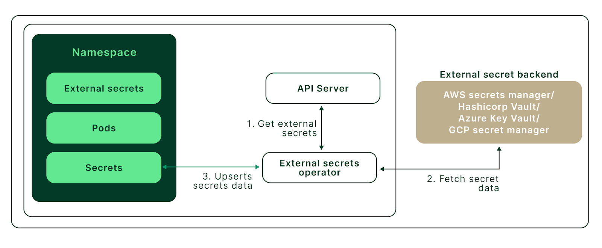

# Table of contents:
1. [What is External Secrets Operator?](#what-is-external-secrets-operator)
2. [What is the goal of External Secrets Operator?](#what-is-the-goal-of-external-secrets-operator)
3. [Why was ESO implemented?](#why-was-eso-implemented)
4. [How ESO Works (High-Level Architecture)](#how-eso-works-high-level-architecture)
5. [Workshop: Deploy External Secrets Operator on EKS cluster and sync with AWS Secrets Manager](#workshop-deploy-external-secrets-operator-on-eks-cluster-and-sync-with-aws-secrets-manager)
    - [Prerequisites](#prerequisites)
    - [Deploy EKS cluster](#deploy-eks-cluster)
    - [Deploy External Secrets Operator](#deploy-external-secrets-operator)
    - [What is Service Accounts?](#what-is-service-accounts)
    - [What is IAM Roles for Service Accounts (IRSA)?](#what-is-iam-roles-for-service-accounts-irsa)
    - [Configuring IRSA and Secrets Manager](#configuring-irsa-and-secrets-manager)
    - [Configure External Secrets Operator](#configure-external-secrets-operator)
    - [Consume Secret in Pod](#consume-secret-in-pod)
6. [Kubernetes External Secrets vs. Kubernetes Secrets](#kubernetes-external-secrets-vs-kubernetes-secrets)
7. [Best Practices](#best-practices)
8. [References](#references)

## What is External Secrets Operator?


[External Secrets Operator](https://external-secrets.io/latest/) (ESO) is a Kubernetes operator that integrates external secret management systems like 
- [AWS Secrets Manager](https://aws.amazon.com/secrets-manager/), 
- [HashiCorp Vault](https://www.vaultproject.io/), 
- [Google Secrets Manager](https://cloud.google.com/secret-manager), 
- [Azure Key Vault](https://azure.microsoft.com/en-us/services/key-vault/), 
- [IBM Cloud Secrets Manager](https://www.ibm.com/cloud/secrets-manager), 
- [CyberArk Conjur](https://www.conjur.org/), 
- [Pulumi ESC](https://www.pulumi.com/product/secrets-management/) and many more. 

The operator reads information from external APIs and automatically injects the values into a Kubernetes Secret.

ESO follows the Kubernetes Operator pattern, continuously reconciling external secrets and ensuring that Kubernetes secrets remain up to date with the external secret store.

## What is the goal of External Secrets Operator?

The goal of External Secrets Operator is to synchronize secrets from external APIs into Kubernetes. ESO is a collection of custom API resources: 
 - [`ExternalSecret`](https://external-secrets.io/latest/api/externalsecret/), 
 - [`SecretStore`](https://external-secrets.io/latest/api/secretstore/),
 - [`ClusterSecretStore`](https://external-secrets.io/latest/api/clustersecretstore/) 

that provide a user-friendly abstraction for the external API that stores and manages the lifecycle of the secrets for you.

## Why was ESO implemented?

ESO was implemented to address security and operational challenges related to secrets management in Kubernetes environments. Managing secrets securely in Kubernetes has historically been a challenge because:

- **Kubernetes Secrets are not encrypted by default**

Kubernetes stores secrets in [etcd](https://etcd.io/) in base64 encoding, which is not encrypted at rest unless manually configured.
Exposing secrets in plain Kubernetes manifests or Helm charts increases the risk of accidental leaks.

- **Manual secret rotation is inefficient and error-prone**

If credentials (e.g., database passwords, API keys) are stored as Kubernetes secrets, updating them requires manual intervention.
ESO automates this process by syncing secrets dynamically.

- **Centralized Secret Management**

Many organizations already use cloud-based secret managers like AWS Secrets Manager or HashiCorp Vault.
ESO allows seamless integration between Kubernetes and external secret stores, ensuring a single source of truth for secrets.

- **Auditability & Compliance**

Cloud-native security and compliance policies often require organizations to track who accesses and updates secrets.
Secret management tools like AWS Secrets Manager provide access logs, versioning, and lifecycle management, which Kubernetes Secrets lack.

- **Multi-cloud and hybrid environments**

Kubernetes workloads may run across multiple cloud providers and on-premises clusters.
ESO provides a unified approach to secrets management, allowing applications to access secrets regardless of where they are deployed.

The **primary motivation** behind External Secrets Operator was to **decouple secrets from Kubernetes and enable seamless integration with external secret management solutions**.

## How ESO Works (High-Level Architecture)



Image credits: [Kubecost](https://www.kubecost.com/kubernetes-devops-tools/kubernetes-external-secrets/)

1. ExternalSecret [CRD (Custom Resource Definition)](https://thenewstack.io/kubernetes-crds-what-they-are-and-why-they-are-useful/) is created in Kubernetes.
2. ESO fetches the secret from the external secret provider.
3. Kubernetes Secret is created or updated with the retrieved value.
4. Applications access the secret as a regular Kubernetes Secret.

## Workshop: Deploy External Secrets Operator on EKS cluster and sync with AWS Secrets Manager

This workshop demonstrates how to install ESO on EKS cluster and sync it with AWS Secrets Manager.

While Kubernetes Secrets are a great way to store secrets within the cluster, they have security and lifecycle management limitations.

Kubernetes External Secrets address these shortcomings by storing secrets externally and providing an in-built secret rotation, robust lifecycle management, and multiple authentication mechanisms.

### Prerequisites
- [`awscli`](https://docs.aws.amazon.com/cli/latest/userguide/getting-started-install.html)
- [`kubectl`](https://kubernetes.io/docs/tasks/tools/)
- [`jq`](https://jqlang.org/)
- [`eksctl`](https://docs.aws.amazon.com/eks/latest/userguide/setting-up.html)
- [`helm`](https://docs.helm.sh/)

### Deploy EKS cluster

To provision EKS cluster:
```bash
eksctl create cluster -f eks-cluster.yaml
```

This will create an EKS cluster with one node group containing a single node in the `us-east-1` AWS region. 

Update the `kubeconfig` file with newly created cluster access:
```bash
aws eks --region us-east-1 update-kubeconfig --name eks-external-secrets
```

Test cluster access by running:
```bash
kubectl get nodes
```

### Deploy External Secrets Operator

Add Helm chart repository [`external-secrets`](https://artifacthub.io/packages/helm/external-secrets-operator/external-secrets) :
```bash
helm repo add external-secrets https://charts.external-secrets.io
```

Install the External Secrets Operator release:
```
helm install external-secrets \
  external-secrets/external-secrets \
    --namespace external-secrets \
    --create-namespace \
    --set installCRDs=true
```


the flag `--set installCRDs=true` ensures that Custom Resource Definitions (CRDs) required by External Secrets Operator (ESO) are installed automatically. Helm charts typically do not install CRDs by default.

CRDs (Custom Resource Definitions) extend Kubernetes by allowing you to define **custom resource types**. External Secrets Operator requires CRDs to function properly because it introduces new Kubernetes resources such as:

- `ExternalSecret` (Fetches secrets from an external provider)
- `SecretStore` (Defines how to connect to an external secret provider)
- `ClusterSecretStore` (A global version of SecretStore)

To check deployment:
```bash
kubectl get pods --namespace external-secrets
```


### What is Service Accounts?

A [**Service Account**](https://kubernetes.io/docs/concepts/security/service-accounts/) in Kubernetes is a **special type of account** for **non-human entities** such as **Pods** used for authentication and interaction with the Kubernetes API or external services **without using user credentials**.

#### **Key Points:**
- Service Accounts are **used by applications** (Pods), not by users.
- Each Pod in Kubernetes **automatically gets a default service account** unless specified otherwise.
- Service Accounts **can have roles and permissions** assigned via **RBAC (Role-Based Access Control)**.
- In **Amazon EKS**, Service Accounts can be linked to **IAM Roles** using **IRSA** (IAM Roles for Service Accounts) to access AWS resources securely.

#### **How Service Accounts Work**
1. A **Service Account is created** in a Kubernetes namespace.
2. **Pods are assigned a Service Account** (either explicitly or by default).
3. The **Pod uses the Service Account's token** to authenticate against the Kubernetes API or external systems (e.g., AWS, Vault).
4. **RBAC roles** define what actions the Service Account can perform.

#### **Example Service Account YAML**
```yaml
apiVersion: v1
kind: ServiceAccount
metadata:
  name: my-service-account
  namespace: my-namespace
```

#### **Use Cases**
- Allowing Pods to **read/write to Kubernetes resources** (e.g., ConfigMaps, Secrets).
- Enabling **external authentication** (e.g., AWS, Vault) using **IRSA**.
- Managing **access control** for workloads within a Kubernetes cluster.

#### **Example Scenarios**
| **Scenario** | **Service Account Required?** | **Reason** |
|-------------|------------------|---------|
| Pod-to-Pod communication using IP or Service | ❌ No | Handled by Kubernetes networking. |
| Pod accessing Kubernetes API | ✅ Yes | Needs authentication (RBAC). |
| Pod accessing AWS Secrets Manager via IRSA | ✅ Yes | Needs IAM role mapping. |
| Pod restricted by Network Policy | ❌ No | Controlled at network level, not by SA. |

Service Accounts **enable secure authentication** for applications running inside Kubernetes without relying on user credentials. They are essential for **RBAC, security best practices, and AWS IAM integration** (via IRSA).

### What is IAM Roles for Service Accounts (IRSA)?

[**IRSA (IAM Roles for Service Accounts)**](https://docs.aws.amazon.com/eks/latest/userguide/iam-roles-for-service-accounts.html) is an AWS feature that allows **Kubernetes workloads running on Amazon EKS** to securely assume **IAM roles** using **Service Accounts**, instead of using node-based IAM roles.

#### **Why IRSA?**
- **Fine-grained access control** – Assign IAM permissions to specific Kubernetes **Pods** rather than entire EC2 nodes.
- **Improved security** – Eliminates the need for long-lived credentials inside containers.
- **Least privilege principle** – Only grant the necessary permissions per workload.
- **AWS-native authentication** – Uses **OIDC (OpenID Connect)** to authenticate Kubernetes service accounts with AWS IAM.

#### **How IRSA Works?**
1. **EKS cluster is associated with an OpenID Connect (OIDC) provider**.
2. **A Kubernetes Service Account is created with an annotation linking to an IAM Role**.
3. **AWS IAM Role is configured with policies** that allow access to AWS services (e.g., S3, Secrets Manager).
4. **The Pod uses the service account** to securely authenticate and access AWS services.

#### **Example Use Case**
- A Kubernetes **Pod** running in EKS needs to read **secrets from AWS Secrets Manager**.
- IRSA allows the Pod to assume an IAM role with **read-only** access to Secrets Manager **without exposing AWS credentials**.

#### **IRSA Example YAML**
```yaml
apiVersion: v1
kind: ServiceAccount
metadata:
  name: my-service-account
  annotations:
    eks.amazonaws.com/role-arn: arn:aws:iam::123456789012:role/my-iam-role
```

### Configuring IRSA and Secrets Manager

To use IRSA, the first step is to create an IAM OIDC Provider for your cluster (if one doesn't already exist). After you associate the provider with your EKS cluster, you can create an IRSA service account that External Secrets will use.

To enable IAM OIDC Provider for your cluster, run the following command:
```bash
eksctl utils associate-iam-oidc-provider --cluster=eks-external-secrets --approve
```


Now, create a secret in AWS Secrets Manager. Create a secret with the name `secret-api-key` and store the `username` and `key` as secret values:
```bash
SECRET_ARN=$(aws secretsmanager create-secret --name secret-api-key \
    --secret-string "{\"username\":\"admin\",\"key\":\"My@P1@ApIKey\"}" \
    --region us-east-1 | jq -r .ARN)
```

Next, create an IAM policy that will grant the permissions to interact with AWS Secrets Manager. For additional security, the following policy only allows for the description and retrieval of a single specified secret:
```bash
IAM_POLICY_ARN=$(aws iam create-policy --policy-name eks-external-secrets-reader --policy-document '{
  "Version": "2012-10-17",
  "Statement": [
    {
      "Effect": "Allow",
      "Action": [
        "secretsmanager:DescribeSecret",
        "secretsmanager:GetSecretValue"
      ],
      "Resource": ["'${SECRET_ARN}'"]
    }
  ]
}' | jq -r .Policy.Arn)
```

For more information, see [Permissions to access secrets](https://docs.aws.amazon.com/secretsmanager/latest/userguide/auth-and-access.html#auth-and-access_secrets)

Finally, create an IRSA service account for the External Secrets Operator to authenticate and fetch the required secrets from AWS Secrets Manager in `default` namespace:
```bash
eksctl create iamserviceaccount \
    --name external-secrets-irsa \
    --namespace default \
    --cluster eks-external-secrets \
    --role-name "external-secrets-irsa-role" \
    --attach-policy-arn $IAM_POLICY_ARN \
    --approve \
    --override-existing-serviceaccounts
```

To verify the successful creation of the Kubernetes Service Account, execute the following command:
```bash
kubectl get sa
```


### Configure External Secrets Operator
To work with External Secrets, we must create two custom Kubernetes resources. [ExternalSecret](https://external-secrets.io/latest/api/externalsecret/) and [SecretStore](https://external-secrets.io/latest/api/secretstore/).

`ExternalSecret` describes what data should be retrieved, processed, and stored as a Kubernetes Secret object.

`SecretStore` specifies how to access and interact with the external APIs. In this example, it is AWS Secrets Manager.

Create these resources:
```bash
kubectl apply -f secret-store.yaml
kubectl apply -f external-secret.yaml
```

Verify ExternalSecret deployment status:
```bash
kubectl get externalsecrets.external-secrets.io
```


After you've created the ExternalSecret resource, you'll be able to see the new Kubernetes Secret that has been synchronized with the Secrets Manager store. Execute the following command:
```bash
kubectl describe secret eks-secret
```


You have now created a Kubernetes Secret that can be used within your pod specification for use by your applications 🚀

### Consume Secret in Pod

Deploy a simple busybox pod in the default namespace and use the secret via pod environment variables:
```bash
kubectl apply -f external-secrets-demo-pod.yaml
```

Once the pod is in a running state, run the following commands to get the container’s shell:
```bash
kubectl exec -it busybox -- sh
```

From the container’s shell, you can use echo to print the environment variables to view the secrets:
```bash
echo $API_USERNAME
```


## Kubernetes External Secrets vs. Kubernetes Secrets

| Feature                     | Kubernetes Secrets                                         | Kubernetes External Secrets                                                       |
|-----------------------------|----------------------------------------------------------|----------------------------------------------------------------------------------|
| **Availability**            | Kubernetes’s default secret management                   | Need to install as Custom Resource Definition (CRD) and custom Operator        |
| **Secret Lifecycle Management** | Difficult to manage secrets at a large scale and across multiple environments | Secrets are stored externally and inherit all the lifecycle features of external service |
| **Security**                | Secrets are not stored as encrypted objects; any entity with cluster access can decode the secrets data | Secrets are managed outside the cluster and stored encrypted |
| **Version Control System**  | Kubernetes Secrets are not secure to include in Version Control Systems | Most external secret management tools provide built-in version history. YAML manifests can be committed to version control as they only contain a reference to the secrets |

## Best Practices

To mitigate the risk of secrets exposure, best practices include:

- Encrypt all sensitive data at rest and in transit
- Rotate secrets regularly
- Use strong passwords and passphrases for accessing external secrets backends
- Restrict access to secrets to only those who need it
- Monitor for unauthorized access using audit logs

## References
- [github.com/external-secrets/external-secrets](https://github.com/external-secrets/external-secrets)
- [Kubernetes External Secrets: How to Store and Use Sensitive Data in Kubernetes Cluster](https://www.kubecost.com/kubernetes-devops-tools/kubernetes-external-secrets/)