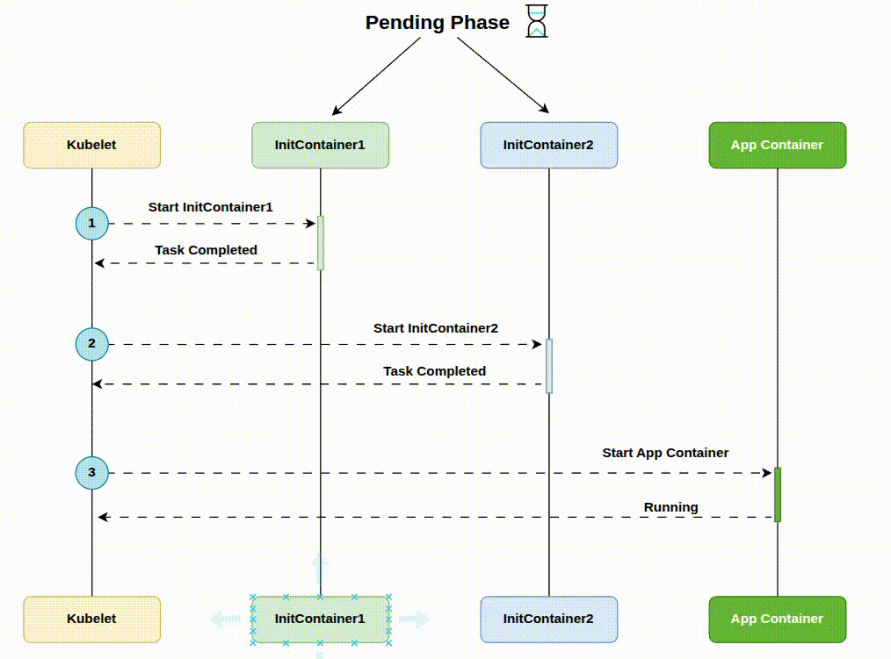

# Introduction to Init Containers

Apart from the *main containers* that run the app logic, the most popular types of additional helper containers in Kubernetes ecosystem are:
- Init containers
- Sidecar containers

**Init containers** in Kubernetes are specialized containers that **run and complete before the main application containers** in a Pod start. They are defined in the Pod's specification and are used to perform setup tasks, such as initializing configurations, downloading dependencies, or ensuring prerequisites are met.

**Key Characteristics:**
- **Sequential Execution**: Init containers run one at a time, in the order defined, and each must complete successfully before the next starts or the main containers begin.
- **One-Time Tasks**: They are designed for short-lived tasks and terminate after completion. If an init container fails, the Pod restarts (subject to its restart policy) until the init container succeeds.
- **Separate Images**: Init containers can use different container images from the main application containers, allowing for modular setup tasks.
- **Shared Resources**: They share the same Pod environment (e.g., volumes, network namespace) as the main containers, enabling them to prepare the environment or populate shared volumes.

## Use Cases

Most often init containers used for:
- Wait for a database service to be ready before starting the app.
- Inject configuration files or secrets into a shared volume for the main app container.
- Perform database schema migrations before launching the main app.

Let's consider **secret injection use case**. Imagine you have an application that requires a secret to connect to an external API. Due to compliance rules, you can’t hardcode this secret into the app or store it in Kubernetes secrets. Instead, you can use an init container to retrieve the secret from a secret management tool like Vault or AWS Secrets Manager and place it in a specific location within the pod, where the main application container can then access it.

This way when the application pod starts, it will have access to the secret to connect to the API.

In short, init containers ensure your applications are always properly configured and initialized before they are started.

## How Init Containers Work?

* The **kubelet** runs init containers **sequentially**, following the order they are listed in the Pod spec, making sure each one completes before starting the next - so only one init container runs at a time.
* Init containers always run **before** the main application containers start.
* If the Pod is **restarted**, all init containers will execute again.
* In the Pod’s **lifecycle**, init containers run to completion during the **pending phase**.
* Although init containers use the same container spec format, they **do not support** `lifecycle`, `livenessProbe`, `readinessProbe`, or `startupProbe` fields (except when using the native sidecar alpha feature).

## References
- [DevOpsCube Blog: Init Containers](https://devopscube.com/kubernetes-init-containers/)
- [Habr Blog: Init Containers](https://habr.com/ru/companies/oleg-bunin/articles/761662/)