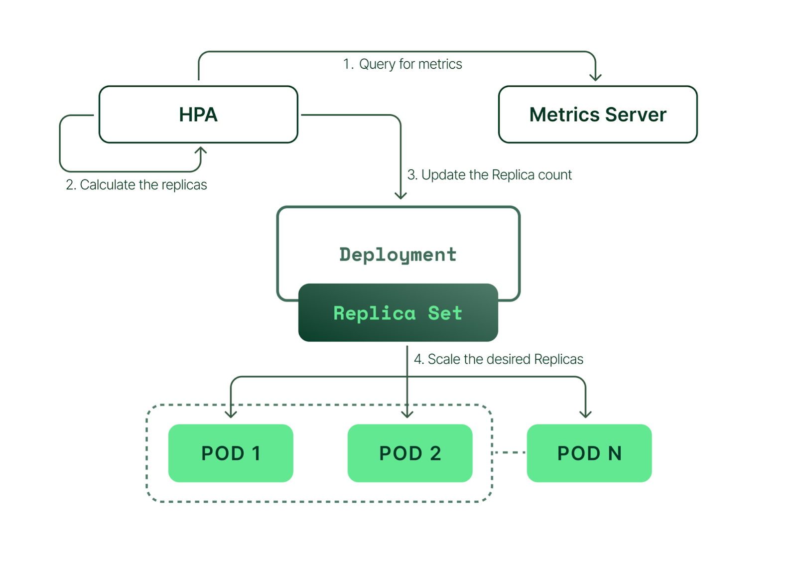

# **Kubernetes Metrics Server**

The [**Kubernetes Metrics Server**](https://kubernetes-sigs.github.io/metrics-server/) is a cluster-wide aggregator of resource usage data, such as **CPU** and **memory** consumption, used by the Kubernetes [**Horizontal Pod Autoscaler (HPA)**](https://kubernetes.io/docs/tasks/run-application/horizontal-pod-autoscale/) and [**Vertical Pod Autoscaler (VPA)**](https://docs.aws.amazon.com/eks/latest/userguide/vertical-pod-autoscaler.html), as well as the `kubectl top` command.

It collects metrics from the **Kubelet** running on each node and provides real-time CPU and memory utilization data via the **Metrics API**. The Metrics Server is not a long-term storage solution for metrics but rather a lightweight, real-time data provider.

---

### **Why Was It Built?**
The Metrics Server was built to address the need for **lightweight, real-time metrics** in Kubernetes, particularly for autoscaling and monitoring. Before its introduction, Kubernetes relied on [**Heapster**](https://github.com/kubernetes-retired/heapster), which was deprecated due to its complexity and limited scalability.

Key reasons why Metrics Server was built:
1. **Enable Autoscaling** – It provides resource usage data required by:
   - **Horizontal Pod Autoscaler (HPA)** to scale pods based on CPU/memory utilization.
   - **Vertical Pod Autoscaler (VPA)** to adjust resource requests/limits dynamically.
   
2. **Improve Performance and Scalability** – Unlike Heapster, Metrics Server is optimized for **efficient, low-latency** metric collection without storing historical data.

3. **Standardize Metrics Collection** – It exposes data via the **Metrics API**, a Kubernetes-native interface that allows tools like `kubectl top` to retrieve real-time metrics.

4. **Reduce Overhead** – Since it does not store long-term data, it is **lighter and more efficient** than Prometheus or other monitoring solutions.

---

### **How It Works**


1. The **Kubelet** on each node exposes resource metrics via the [**cAdvisor**](https://www.kubecost.com/kubernetes-devops-tools/cadvisor/) component.
2. Metrics Server **scrapes** this data from all Kubelets using the **Summary API**.
3. The data is aggregated and exposed via the **Metrics API** (`/apis/metrics.k8s.io`).
4. The **HPA**, **VPA**, and `kubectl top` command retrieve this data as needed.

---

### **Limitations**
- Does **not** store historical data (use Prometheus for long-term monitoring).
- Only provides **CPU and memory metrics** (not network or disk I/O).
- Requires correct **RBAC permissions** to access metrics.

---

### **Metrics Server Installation**

Metrics server can be installed:
- Kubernetes manifest files
- Helm charts
- (EKS case): via addon

For more information, see [Installation](https://github.com/kubernetes-sigs/metrics-server?tab=readme-ov-file#installation)

---

### **Installation via Helm**

Metrics server can be installed by using [Bitnami Helm chart](https://artifacthub.io/packages/helm/bitnami/metrics-server)

1. Add Bitnami repository:
```bash
helm repo add bitnami https://charts.bitnami.com/bitnami
```
2. To install metrics server:
```bash
helm upgrade --install metrics-server bitnami/metrics-server \
    --version 7.4.0 \
    --create-namespace --namespace metrics-server \
    --set apiService.create=true \
    --set --kubelet-insecure-tls=true \
    --set --kubelet-preferred-address-type=InternalIP
```

- `version`: Specifies the metrics-server version.
- `--set apiService.create=true`: Configures the Helm chart to **register the Metrics API service** (`metrics.k8s.io`) with the Kubernetes API server. This is required for Kubernetes to recognize and use the Metrics Server.
- `--set kubelet-insecure-tls=true`: Allows the Metrics Server to connect to the **Kubelet API without verifying TLS certificates**. Useful in clusters where **self-signed certificates** or improperly configured TLS may cause issues. **Security risk**: This should be used **only in non-production or when necessary**.
- `--set kubelet-preferred-address-type=InternalIP`: Tells the Metrics Server to prefer the Internal IP address of Kubernetes nodes when communicating with the Kubelet. Useful in clusters where external addresses are not routable (e.g., private or on-prem environments).

---

### **Test HPA and Metrics Server in Action**


Image credits: [Kubecost](https://www.kubecost.com/kubernetes-autoscaling/kubernetes-hpa/)

1. To create a php-apache deployment, run the following command:
```bash
kubectl create deployment php-apache --image=k8s.gcr.io/hpa-example
```
2. To set the CPU requests, run the following command:
```bash
kubectl patch deployment php-apache -p='{"spec":{"template":{"spec":{"containers":[{"name":"hpa-example","resources":{"requests":{"cpu":"200m"}}}]}}}}'
```
> [!CAUTION]
> If you don't set the value for cpu correctly, then the CPU utilization metric for the pod isn't defined and the HPA can't scale.

3. To expose the deployment as a service, run the following command:
```bash
kubectl create service clusterip php-apache --tcp=80
```
4. To create an HPA, run the following command:
```bash
kubectl autoscale deployment php-apache --cpu-percent=50 --min=1 --max=10
```
5. To confirm that the HPA was created, run the following command:
```bash
kubectl get hpa
```

6. To create a pod to connect to the deployment that you created earlier, run the following command:
```bash
kubectl run -i --tty load-generator --image=busybox /bin/sh
```
To connect back to the pod in a new shell:
```bash
kubectl exec -it load-generator -- /bin/sh
```
7. To test a load on the pod in the namespace that you used in step 1, run the following script:
```bash
while true; do wget -q -O- http://php-apache; done
```
**NOTE**: To exit the while loop and the tty session of the load generator pod, use CTRL + C to cancel the loop. Then, use CTRL + D to exit the session.
8.  To see how the HPA scales the pod based on CPU utilization metrics, run the following command (preferably from another terminal window):
```bash
kubectl get hpa -w
```

9. To clean up the resources used for testing the HPA, run the following commands:
```bash
kubectl delete hpa,service,deployment php-apache
kubectl delete pod load-generator
```

---

### **How HPA Scales Down**
**HPA (Horizontal Pod Autoscaler)** will **automatically scale down** the number of replicas when the load decreases. 


However, this does not happen immediately; there are **default cooldown periods** and conditions that must be met.

1. **CPU or Memory Drops Below Target:**  
   - Since in our example HPA was set to `--cpu-percent=50`, once CPU usage **drops below 50%**, it starts considering scaling down.
   
2. **Stabilization Window Applies:**  
   - **Default scale-down stabilization period** is **5 minutes** (`--horizontal-pod-autoscaler-downscale-stabilization=5m`).
   - This means that even if the load is zero, HPA **waits for 5 minutes** before reducing replicas. For more information, see [How does a HorizontalPodAutoscaler work?](https://kubernetes.io/docs/tasks/run-application/horizontal-pod-autoscale/#support-for-cooldown-delay)

3. **HPA Checks Metrics Every 15 Seconds:**  
   - The HPA controller queries metrics every **15 seconds** (`horizontal-pod-autoscaler-sync-period`).
   - If the **average CPU usage** is still low for the entire stabilization period, it starts **scaling down gradually**.

---

### **References**
- [Kubernetes Metrics Server](https://kubernetes-sigs.github.io/metrics-server/)
- [AWS Docs: Scale pod deployments with Horizontal Pod Autoscaler](https://docs.aws.amazon.com/eks/latest/userguide/horizontal-pod-autoscaler.html)
- [Kubecost Blog: What is cAdvisor?](https://www.kubecost.com/kubernetes-devops-tools/cadvisor/)
- [GitHub issue: YAML parse errors for metrics-server deployments with extraArgs #10570](https://github.com/bitnami/charts/issues/10570)
- [Kubecost Blog: Kubernetes HPA](https://www.kubecost.com/kubernetes-autoscaling/kubernetes-hpa/)
- [AWS RePost: How do I set up Kubernetes Metrics Server and Horizontal Pod Autoscaler on Amazon EKS?](https://repost.aws/knowledge-center/eks-metrics-server-pod-autoscaler)
- [YouTube: Installing metrics-server | Jérôme Petazzoni LKE Workshop](https://www.youtube.com/watch?v=qUW1tsSXCkQ)