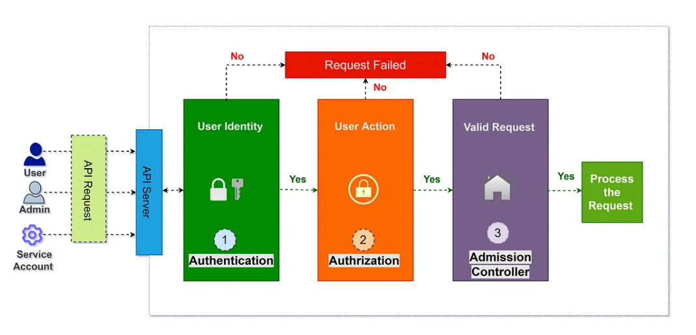
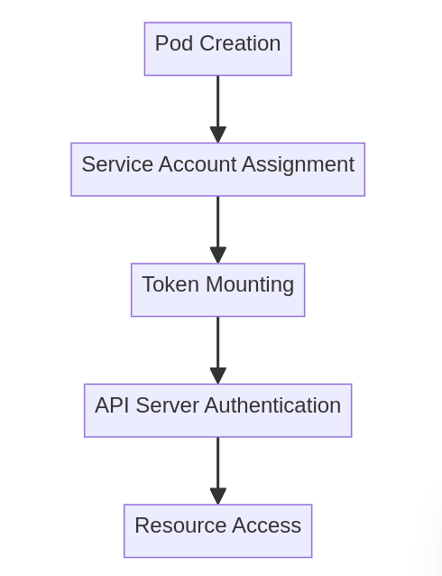

# Role-Based Access Control (RBAC) in Kubernetes

[Role-Based Access Control (RBAC)](https://kubernetes.io/docs/reference/access-authn-authz/rbac/) in Kubernetes is a security mechanism that controls user and application permissions within a cluster. It allows administrators to define **who** (users, groups, or service accounts) can perform **what** (specific actions) on **which resources**. This ensures a **principle of least privilege**, where users and applications only have access to the resources necessary for their operation.

By defining **Roles and RoleBindings** for namespace-level access and **ClusterRoles and ClusterRoleBindings** for cluster-wide access, Kubernetes ensures fine-grained control over who can access which resources. Properly configured RBAC helps organizations maintain security, prevent unauthorized access, and ensure compliance with best practices.

In overall Kubernetes API request [authentication process](https://kubernetes.io/docs/reference/access-authn-authz/), RBAC presents one of the available **authorization methods**:



Image credits: [MrDevSecOps](https://medium.com/@mrdevsecops/kubernetes-rbac-role-based-access-control-c825c50fbe38)

## Table of contents:
- [Core Components of RBAC](#core-components-of-rbac)
- [Roles and RoleBindings](#roles-and-rolebindings)
- [ClusterRoles and ClusterRoleBindings](#clusterroles-and-clusterrolebindings)
- [RBAC in Action](#rbac-in-action)
- [Available RBAC actions](#available-rbac-actions)
- [Service Accounts and RBAC](#service-accounts-and-rbac)
- [Verifying RBAC Permissions](#verifying-rbac-permissions)
- [Best Practices](#best-practices)
- [References](#references)

## **Core Components of RBAC**
RBAC in Kubernetes consists of four main objects: 
- **Roles**, 
- **RoleBindings**, 
- **ClusterRoles**, 
- **ClusterRoleBindings**.

## **Roles and RoleBindings**
A **Role** always defines a set of permissions within a specific namespace. This means that permissions granted by a Role are limited to a single namespace and cannot extend beyond it. Permissions are purely additive (there are no "deny" rules).

If you want to define a role within a namespace, use a Role; if you want to define a role cluster-wide, use a ClusterRole.

For example, suppose you have a development team working in the `dev` namespace, and you want to allow them to list and get pods but not delete them. You can define a Role as follows:

```yaml
apiVersion: rbac.authorization.k8s.io/v1
kind: Role
metadata:
  name: dev-team-pod-reader
  namespace: dev
rules:
- apiGroups: [""] # "" indicates the core API group
  resources: ["pods"]
  verbs: ["get", "list"]
```

This **Role** grants permission to retrieve and list pods within the `dev` namespace.

Once the Role is created, it must be associated with a user, group, or service account using a **RoleBinding**. A RoleBinding grants permissions within a specific namespace whereas a ClusterRoleBinding grants that access cluster-wide.

```yaml
apiVersion: rbac.authorization.k8s.io/v1
kind: RoleBinding
metadata:
  name: dev-team-pod-reader-binding
  namespace: dev
subjects:
# You can specify more than one "subject"
- kind: User
  name: alice # "name" is case sensitive
  apiGroup: rbac.authorization.k8s.io
roleRef:
  # "roleRef" specifies the binding to a Role / ClusterRole
  kind: Role # this must be Role or ClusterRole
  name: dev-team-pod-reader # this must match the name of the Role or ClusterRole you wish to bind to
  apiGroup: rbac.authorization.k8s.io
```

This **RoleBinding** assigns the `dev-team-pod-reader` Role to the user `alice`, meaning she can list and get pods within the `dev` namespace.

## **ClusterRoles and ClusterRoleBindings**
While a **Role** is restricted to a namespace, a **ClusterRole** applies across the entire cluster. This is useful for granting permissions to cluster-wide resources such as nodes, PersistentVolumes, or the ability to manage namespaces.

For example, suppose an administrator needs the ability to list all nodes in the cluster. You can define a **ClusterRole**:

```yaml
apiVersion: rbac.authorization.k8s.io/v1
kind: ClusterRole
metadata:
  # "namespace" omitted since ClusterRoles are not namespaced
  name: node-viewer
rules:
- apiGroups: [""]
  # at the HTTP level, the name of the resource for accessing Nodes objects is "nodes"
  resources: ["nodes"]
  verbs: ["get", "list"]
```

Then, bind this role to a user using a **ClusterRoleBinding**:

```yaml
apiVersion: rbac.authorization.k8s.io/v1
kind: ClusterRoleBinding
metadata:
  name: node-viewer-binding
subjects:
- kind: User
  name: admin-user # name is case sensitive
  apiGroup: rbac.authorization.k8s.io
roleRef:
  kind: ClusterRole
  name: node-viewer
  apiGroup: rbac.authorization.k8s.io
```

Now, `admin-user` can list nodes across the entire cluster.

After you create a binding, you cannot change the Role or ClusterRole that it refers to. If you try to change a binding's `roleRef`, you get a validation error. If you do want to change the `roleRef` for a binding, you need to remove the binding object and create a replacement.

## **RBAC in Action**
Imagine an organization with multiple teams using the same Kubernetes cluster:
- A **developer team** needs access to manage pods within a `dev` namespace.
- A **security team** should be able to audit logs but not modify workloads.
- A **cluster administrator** needs full control over all resources.

By configuring RBAC properly, Kubernetes ensures that each team gets only the access they require, preventing accidental or malicious changes. For instance, if the security team should only be able to **view** logs, a **ClusterRole** can be created granting `get` and `list` access to logs, but **not** delete permissions.

## Available RBAC actions
Verbs define the actions you can perform on Kubernetes resources. You can also use wildcards (`*`).

| Verb              | Action                                                            |
|------------------|------------------------------------------------------------------|
| Get              | Allows the user to retrieve the state of a Kubernetes resource.  |
| List            | Allows the user to retrieve a list of Kubernetes resources.      |
| Watch          | Allows the user to receive notifications when the state of a Kubernetes resource changes. |
| Create         | Allows the user to create a new Kubernetes resource.              |
| Update         | Allows the user to update an existing Kubernetes resource.        |
| Patch          | Allows the user to make partial updates to an existing Kubernetes resource. |
| Delete         | Allows the user to delete an existing Kubernetes resource.        |
| Deletecollection | Allows the user to delete a collection of Kubernetes resources. |
| Proxy          | Allows the user to access the Kubernetes API server through a proxy. |
| Connect        | Allows the user to connect to the console of a Kubernetes container. |
| Redirect       | Allows the user to redirect traffic to a Kubernetes service.      |
| Portforward    | Allows the user to forward network traffic to a Kubernetes pod.   |


## **Service Accounts and RBAC**
In Kubernetes, applications often need permissions to interact with the cluster. Instead of using user accounts, [service accounts](https://kubernetes.io/docs/tasks/configure-pod-container/configure-service-account/) are assigned to pods via RBAC.

For example, suppose you have a monitoring application running inside a pod that needs to access pod metrics. You can create a **ServiceAccount** and bind it to a **Role**:

```yaml
apiVersion: v1
kind: ServiceAccount
metadata:
  name: metrics-reader
  namespace: monitoring
```

Then, assign permissions to the service account:

```yaml
apiVersion: rbac.authorization.k8s.io/v1
kind: Role
metadata:
  name: metrics-viewer
  namespace: monitoring
rules:
- apiGroups: [""]
  resources: ["pods", "nodes"]
  verbs: ["get", "list"]
```

And bind it:

```yaml
apiVersion: rbac.authorization.k8s.io/v1
kind: RoleBinding
metadata:
  name: metrics-viewer-binding
  namespace: monitoring
subjects:
- kind: ServiceAccount
  name: metrics-reader
  namespace: monitoring
roleRef:
  kind: Role
  name: metrics-viewer
  apiGroup: rbac.authorization.k8s.io
```

Now, any pod running under the `metrics-reader` service account in the `monitoring` namespace will be able to fetch pod and node metrics.

**NOTE**  
- `system:serviceaccount`: (singular) is the prefix for service account usernames.
- `system:serviceaccounts`: (plural) is the prefix for service account groups.

### Key Characteristics of Service Accounts

| Attribute            | Description                                        |
|----------------------|----------------------------------------------------|
| Namespace Scope     | Each service account is created within a specific namespace. |
| Token Generation    | Automatically generates authentication tokens.     |
| API Access Control  | Defines permissions for accessing cluster resources. |

**Service Account Workflow**  



When a pod is created with a specific service account, Kubernetes automatically:
- Generates a token
- Mounts the token as a secret volume
- Provides API access based on defined roles

This approach ensures secure, controlled access to Kubernetes cluster resources for applications running in pods.

### Basic commands for Service Accounts

To create a new service account:
```bash
kubectl create serviceaccount my-service-account -n default
```

To verify service account creation
```bash
kubectl get serviceaccount my-service-account -n default -o yaml
```

**NOTE**  
To list all SAs available in cluster, use `audit_k8s_sa.sh` bash script.

## **Verifying RBAC Permissions**
To check whether a user or service account has a certain permission, Kubernetes provides the `kubectl auth can-i` command:

```sh
kubectl auth can-i get pods --as alice -n dev
```

This checks if `alice` can retrieve pod information in the `dev` namespace.

For service accounts:

```sh
kubectl auth can-i list nodes --as=system:serviceaccount:monitoring:metrics-reader
```

This checks if the `metrics-reader` service account can list nodes.

## Best Practices

### **1. Follow the Principle of Least Privilege (PoLP)**
Always grant the **minimum** set of permissions required for a user or service to function. Over-permissioning can lead to security risks, including accidental modifications and potential breaches.

**Example**:  
If a developer only needs to view logs, grant them a `Role` with `get` and `list` permissions, rather than full access to pods.

```yaml
apiVersion: rbac.authorization.k8s.io/v1
kind: Role
metadata:
  name: pod-logs-viewer
  namespace: dev
rules:
- apiGroups: [""]
  resources: ["pods/log"]
  verbs: ["get", "list"]
```

### **Default RBAC roles**
`Cluster-admin` and `system:masters` are built-in Kubernetes RBAC Roles that grant users or service accounts powerful permissions across the entire cluster. Both Roles are included in Kubernetes by default, but you should only use them when absolutely necessary.
- **Cluster-admin**: The cluster-admin Role grants full control over all resources in the cluster, including the ability to create, modify, and delete resources in any namespace. This Role is for cluster administrators who need full control over the cluster and should be used cautiously as it grants unrestricted access.
- **System:masters**: The `system:masters` Role grants read and write access to most resources in the cluster but does not grant full control over the cluster. Users or service accounts with this Role can create, modify, and delete resources in most namespaces. Still, they cannot perform certain privileged operations, such as modifying the cluster's control plane components. This Role suits users or service accounts needing elevated permissions to perform specific administrative tasks.

---

### **2. Use Namespaced Roles Instead of ClusterRoles Whenever Possible**
A **Role** is scoped to a namespace, while a **ClusterRole** applies to the entire cluster.  
To minimize risks, use **Role** instead of **ClusterRole** unless access to cluster-wide resources is absolutely necessary.

**Example**:  
Instead of this broad ClusterRole:

```yaml
apiVersion: rbac.authorization.k8s.io/v1
kind: ClusterRole
metadata:
  name: cluster-wide-pod-manager
rules:
- apiGroups: [""]
  resources: ["pods"]
  verbs: ["get", "list", "create", "delete"]
```

Prefer defining permissions within a namespace:

```yaml
apiVersion: rbac.authorization.k8s.io/v1
kind: Role
metadata:
  name: namespace-pod-manager
  namespace: dev
rules:
- apiGroups: [""]
  resources: ["pods"]
  verbs: ["get", "list", "create", "delete"]
```

---

### **3. Bind Roles to Groups Instead of Individual Users**
Instead of binding roles to users directly, bind them to **groups**. This makes access control easier to manage as users change over time.

**Example**:  
Instead of assigning a role to `alice` individually:

```yaml
subjects:
- kind: User
  name: alice
  apiGroup: rbac.authorization.k8s.io
```

Assign it to a group (`developers`):

```yaml
subjects:
- kind: Group
  name: developers
  apiGroup: rbac.authorization.k8s.io
```

Then, you can add/remove users from the **developers** group in your identity provider without modifying RBAC.

---

### **4. Avoid Granting `*` (Wildcard) Permissions**
Using `"*"` (which means all resources or all actions) can lead to excessive privileges.

🚫 **Bad Practice (Overly Broad Role):**
```yaml
rules:
- apiGroups: [""]
  resources: ["*"]
  verbs: ["*"]
```

✅ **Good Practice (Explicit Permissions):**
```yaml
rules:
- apiGroups: [""]
  resources: ["pods", "services"]
  verbs: ["get", "list"]
```

---

### **5. Restrict Access to Secrets**
Kubernetes stores sensitive information (API keys, passwords) in **Secrets**. To prevent leaks, limit access to Secrets strictly to trusted entities.

🚫 **Avoid this:**  
```yaml
resources: ["secrets"]
verbs: ["*"]
```

✅ **Better approach:**  
Allow only specific service accounts or admins to **read** secrets when necessary.

```yaml
resources: ["secrets"]
verbs: ["get"]
```

---

### **6. Use Service Accounts for Applications**
Applications running inside Kubernetes should use **ServiceAccounts** instead of user credentials. Avoid using the **default** service account.

✅ **Good Practice:**  
Create a dedicated service account for an application.

```yaml
apiVersion: v1
kind: ServiceAccount
metadata:
  name: app-service-account
  namespace: production
```

Then, bind a **Role** to it:

```yaml
apiVersion: rbac.authorization.k8s.io/v1
kind: RoleBinding
metadata:
  name: app-role-binding
  namespace: production
subjects:
- kind: ServiceAccount
  name: app-service-account
  namespace: production
roleRef:
  kind: Role
  name: app-role
  apiGroup: rbac.authorization.k8s.io
```

---

### **7. Audit RBAC Permissions Regularly**
Regularly review and clean up unused RBAC roles and bindings to minimize risk.

🔹 To check who has access to what:
```sh
kubectl get roles,rolebindings,clusterroles,clusterrolebindings --all-namespaces
```

🔹 To check if a user has a specific permission:
```sh
kubectl auth can-i delete pods --as alice -n dev
```

🔹 To check what permissions a user has:
```sh
kubectl describe rolebinding dev-team-binding -n dev
```

---

### **8. Use Kubernetes API Aggregation Layer Wisely**
When using custom API extensions, ensure that RBAC rules apply to them as well. Some custom controllers may need extra permissions but should not be over-permissioned.

---

### **9. Implement Automated RBAC Policy Enforcement**
Use tools like [**Kyverno**](https://kyverno.io/) or [**OPA (Open Policy Agent)**](https://www.openpolicyagent.org/) to enforce RBAC best practices. You can define policies that:
- Prevent users from creating wildcard permissions (`*`).
- Restrict who can create `ClusterRoleBindings`.
- Enforce naming conventions for roles and many more.

---

### **10. Enable RBAC Logging for Security Audits**
Enable **Kubernetes audit logs** to track RBAC-related actions.  
This helps in identifying unauthorized access attempts.

🔹 To enable auditing, modify the `kube-apiserver` startup arguments:
```sh
--audit-log-path=/var/log/kubernetes/kube-apiserver-audit.log
--audit-log-maxage=30
--audit-policy-file=/etc/kubernetes/audit-policy.yaml
```

For more information, see [Log backend](https://kubernetes.io/docs/tasks/debug/debug-cluster/audit/#log-backend)

Define an audit policy:
```yaml
apiVersion: audit.k8s.io/v1
kind: Policy
rules:
- level: Metadata
  verbs: ["create", "delete", "update", "patch"]
  resources:
  - group: ""
    resources: ["pods", "secrets"]
```

---

By following these best practices, you can create a **secure, manageable, and scalable** RBAC implementation in Kubernetes. Properly defined roles and bindings ensure that users and applications operate within their required permissions while minimizing security risks. Regular audits, restricted secret access, and enforcement of the principle of least privilege will significantly strengthen the security posture of your Kubernetes cluster.

## References
- [Kubernetes Docs: Using RBAC Authorization](https://kubernetes.io/docs/reference/access-authn-authz/rbac/)
- [Kubecost Blog: Kubernetes RBAC: Best Practices & Examples](https://www.kubecost.com/kubernetes-best-practices/kubernetes-rbac-best-practices/)
- [Labex: How to Configure and Secure Kubernetes Service Accounts](https://labex.io/tutorials/kubernetes-how-to-configure-and-secure-kubernetes-service-accounts-394985)