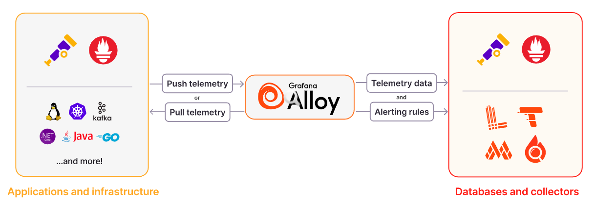
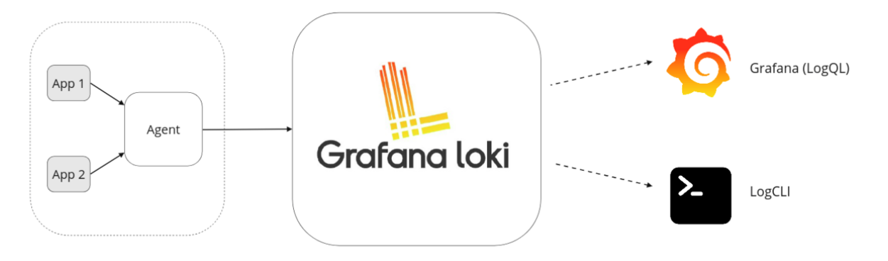
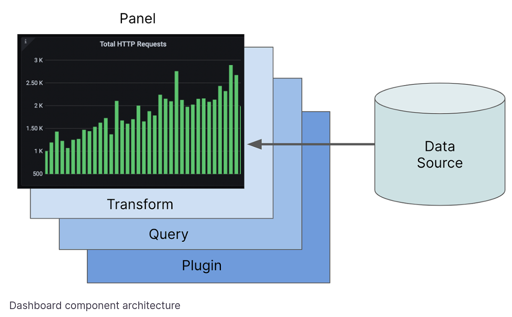
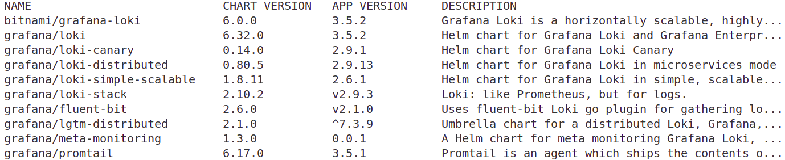
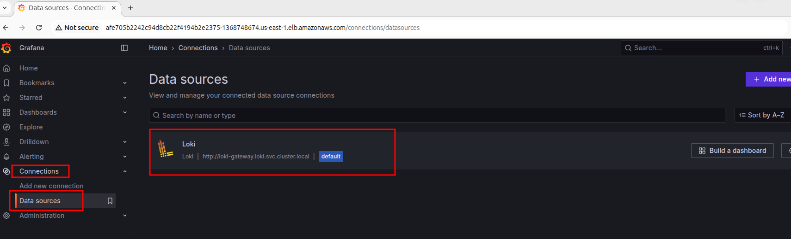
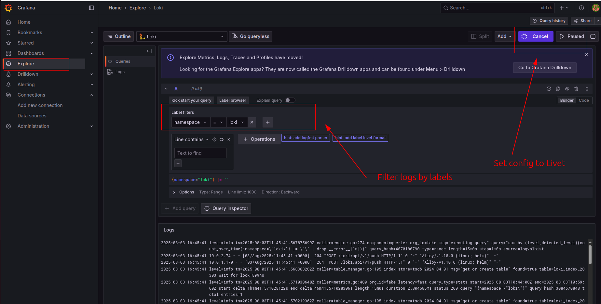

# Install Grafana Loki on Kubernetes by using Helm

[Grafana Loki](https://grafana.com/docs/loki/latest/) is an open-source, highly-scalable, multi-tenant log aggregation system. Inspired by Prometheus, it takes a unique and cost-effective approach to handling logs, particularly in cloud-native environments like Kubernetes. **Unlike traditional logging systems that index the full text of logs, Loki indexes only a small set of labels associated with each log stream, making it incredibly efficient in terms of storage and resource consumption**.

At its core, Loki is designed for developers and operators who need to quickly and easily correlate logs with other observability data, such as metrics and traces. Its tight integration with [Grafana](https://grafana.com/grafana/), a popular open-source platform for monitoring and observability, provides a seamless experience for visualizing and exploring logs alongside other critical system information.

### How It Works: The "Index Less, Store More" Philosophy

**The fundamental principle behind Loki is its minimalist approach to indexing**. Instead of ingesting and indexing the entire content of every log message, which can be resource-intensive, Loki only indexes a set of key-value pairs called **labels**. These labels provide metadata about the logs, such as the application name, environment, or server.

The log data itself is compressed and stored in object storage, such as Amazon S3, Google Cloud Storage, or a local filesystem. This separation of indexing and storage leads to several key benefits:

* **Cost-Effectiveness:** By only indexing labels, Loki significantly reduces storage and indexing overhead, leading to lower operational costs.
* **High Ingestion Rate:** The simplified indexing process allows Loki to ingest a high volume of logs with minimal performance impact.
* **Scalability:** Loki's architecture is designed for horizontal scalability, allowing it to handle petabytes of log data per day.

For more information, see [Loki architecture](https://grafana.com/docs/loki/latest/get-started/architecture/#loki-architecture)

### Data Format

Grafana Loki has two main file types: **index** and **chunks**:
- The [index](https://grafana.com/docs/loki/latest/get-started/architecture/#index-format) is a table of contents of where to find logs for a specific set of labels.
- The [chunk](https://grafana.com/docs/loki/latest/get-started/architecture/#chunk-format) is a container for log entries for a specific set of labels.


### The Loki Stack: Key Components

A typical Grafana Loki setup consists of three main components:

1.  **Promtail (or Grafana Alloy):** This is the agent responsible for collecting logs from various sources. It tails log files, attaches labels to the log streams, and pushes them to the Loki server. [Grafana Alloy](https://grafana.com/docs/alloy/latest/) is the successor to Promtail, offering a more unified and powerful way to collect telemetry data.



2.  [**Loki:**](https://grafana.com/docs/loki/latest/) This is the main server that ingests, stores, and processes the logs. It receives log streams from Promtail/Alloy, indexes the labels, and stores the compressed log content.



3.  [**Grafana:**](https://grafana.com/docs/grafana/latest/fundamentals/dashboards-overview/) This is the visualization layer. Grafana provides a powerful and intuitive interface for querying, analyzing, and visualizing logs stored in Loki using its native query language, **LogQL**.



## Access Kubernetes Cluster

To update your local kubeconfig file and access cluster, run:
```bash
aws eks update-kubeconfig --region us-east-1 --name eks-cluster
```

Verify access:
```bash
kubectl get no
```

## Amazon EBS CSI Driver

This driver is required for Cluster PV storage. The Amazon EKS add-on name is [`aws-ebs-csi-driver`](https://docs.aws.amazon.com/eks/latest/userguide/workloads-add-ons-available-eks.html).

### IAM Role for Provisioning EBS Storage

List the existing node groups:
```bash
aws eks list-nodegroups --cluster-name eks-cluster
```

Identify the existing EKS IAM Node Role Name:
```bash
aws eks describe-nodegroup \
  --cluster-name eks-cluster \
  --nodegroup-name YOUR_NODE_GROUP_NAME \
  --query "nodegroup.nodeRole" \
  --output text
```

Attach the [AmazonEBSCSIDriverPolicy](https://docs.aws.amazon.com/aws-managed-policy/latest/reference/AmazonEBSCSIDriverPolicy.html) AWS managed policy:
```bash
aws iam attach-role-policy \
  --role-name <YOUR_NODE_ROLE_NAME> \
  --policy-arn arn:aws:iam::aws:policy/service-role/AmazonEBSCSIDriverPolicy
```

To check the PVC provisioning:
```bash
kubectl get pvc -n loki
kubectl describe pvc storage-loki-0 -n loki
```

## Install Grafana Helm Repo

Add a Grafana repo to your system to download the helm chart and set up Loki:
```bash
helm repo add grafana https://grafana.github.io/helm-charts
```

Update the Helm Chart repos:
```bash
helm repo update
```

To find Loki related Hem Chart repos:
```bash
helm search repo loki
```



From these repos, we are going to use the `grafana/loki` Helm chart repo to deploy Loki.

## Customize the Loki Helm Values

Use the below command to save the default values of the helm chart in a YAML file:
```bash
helm show values grafana/loki > loki.yaml
```

The custom Loki values are specified in `values.yaml` file.

In the Loki Helm config values:
```yaml
deploymentMode: SingleBinary

singleBinary:
  replicas: 1
  persistence:
    storageClass: gp2
    accessModes:
      - ReadWriteOnce
    size: 20Gi
```

The `SingleBinary` specifies the deployment mode for Loki as a whole monolithic app. It is a single binary deployment, which means all its components, such as the ingester, distributor, etc, run as a single pod.

## Loki Deployment

Once the values file is set, deploy the Loki Helm chart with the values file using the following command:
```bash
helm install loki grafana/loki -n loki --create-namespace -f loki-values.yaml
```

Verify that deployment:
```bash
kubectl get po -n loki
```

### Installation Notes
```
NOTES:
***********************************************************************
 Welcome to Grafana Loki  
 Chart version: 6.32.0  
 Chart Name: loki  
 Loki version: 3.5.2  
***********************************************************************

** Please be patient while the chart is being deployed **

Tip:

  Watch the deployment status using the command: kubectl get pods -w --namespace loki

If pods are taking too long to schedule make sure pod affinity can be fulfilled in the current cluster.

***********************************************************************
Installed components:
***********************************************************************
* loki

Loki has been deployed as a single binary.
This means a single pod is handling reads and writes. You can scale that pod vertically by adding more CPU and memory resources.


***********************************************************************
Sending logs to Loki
***********************************************************************

Loki has been configured with a gateway (nginx) to support reads and writes from a single component.

You can send logs from inside the cluster using the cluster DNS:

http://loki-gateway.loki.svc.cluster.local/loki/api/v1/push

You can test to send data from outside the cluster by port-forwarding the gateway to your local machine:

  kubectl port-forward --namespace loki svc/loki-gateway 3100:80 &

And then using http://127.0.0.1:3100/loki/api/v1/push URL as shown below:

```
curl -H "Content-Type: application/json" -XPOST -s "http://127.0.0.1:3100/loki/api/v1/push"  \
--data-raw "{\"streams\": [{\"stream\": {\"job\": \"test\"}, \"values\": [[\"$(date +%s)000000000\", \"fizzbuzz\"]]}]}"
```

Then verify that Loki did receive the data using the following command:

```
curl "http://127.0.0.1:3100/loki/api/v1/query_range" --data-urlencode 'query={job="test"}' | jq .data.result
```

***********************************************************************
Connecting Grafana to Loki
***********************************************************************

If Grafana operates within the cluster, you'll set up a new Loki datasource by utilizing the following URL:

http://loki-gateway.loki.svc.cluster.local/
```

### `loki-0` Pod

The `loki-0` pod is the **main Loki instance** itself. Based on `values.yaml` file, this single pod is responsible for all of Loki's core functions: receiving, indexing, storing, and serving queries for your logs.

The name `loki-0` indicates it's the first replica (index 0) of a Kubernetes **StatefulSet**. The Helm chart uses a StatefulSet for the main Loki pod to provide it with a stable network identity and a dedicated **Persistent Volume Claim (PVC)** for storage.

### `loki-0` in "Pending" state

If your output shows `loki-0` is stuck in the **Pending** state with `0/2` containers ready, then this is almost always a storage-related issue or lack of enough available memory.

The pod is waiting for its requested 20Gi persistent volume to be provisioned by your EKS cluster. It cannot start until the storage is attached. This can happen if:

  * The `gp2` StorageClass is not available or configured correctly in your cluster.
  * There are issues with the AWS EBS CSI driver that manages volume creation.

To find the exact cause, run the following command to see the pod's event log:

```bash
kubectl describe pod loki-0 --namespace loki
```

or for more precise:
```bash
kubectl get events -n loki --sort-by='.lastTimestamp'
```

To check the available node resources:
```bash
kubectl top nodes
```

To make the `top` command available in your cluster, install [`metrics-server`](https://docs.aws.amazon.com/eks/latest/userguide/metrics-server.html):
```bash
kubectl apply -f https://github.com/kubernetes-sigs/metrics-server/releases/latest/download/components.yaml
```

Look at the `Events` section at the bottom of the output for error messages about volume provisioning.

This is the example of error message that you might receive:
```
Events:
  Type     Reason            Age                  From               Message
  ----     ------            ----                 ----               -------
  Warning  FailedScheduling  72s (x2 over 6m34s)  default-scheduler  0/2 nodes are available: 2 Insufficient memory. preemption: 0/2 nodes are available: 2 No preemption victims found for incoming pod.
```

For **memory issues**, you can check memory availability per node with:
```bash
kubectl describe nodes | grep -A5 "Allocatable"
```

To avoid **memory issues**, you have to lower the requests and limits for Loki pod in `values.yaml` file:
```yaml
loki:
  resources:
    requests:
      memory: "512Mi"
      cpu: "100m"
    limits:
      memory: "1Gi"
      cpu: "500m"
```

Then redeploy the Chart:
```bash
helm upgrade --install loki grafana/loki -n loki -f loki-values.yaml
```

## Customize the Grafana Alloy Helm Values

[Grafana Alloy](https://grafana.com/docs/alloy/latest/) is a log collection agent for Loki.

Alloy is a flexible, high performance, vendor-neutral distribution of the [OpenTelemetry](https://opentelemetry.io/ecosystem/distributions/) Collector. It’s fully compatible with the most popular open source observability standards such as OpenTelemetry and Prometheus.

To download the default Alloy Helm Values:
```bash
helm show values grafana/alloy > alloy-default.yaml
```

For more information, see [Alloy configuration blocks](https://grafana.com/docs/alloy/latest/reference/config-blocks/).

Once the values file is set, deploy the Alloy application with the values file using the following command:
```bash
helm install grafana-alloy grafana/alloy -n loki -f alloy-values.yaml
```

This is the commented version of Alloy values:
```yaml
# This section defines the configuration for the Grafana Alloy agent.
alloy:
  # 'configMap' holds the Alloy configuration file content, which will be mounted into the Alloy pods.
  configMap:
    # 'content' contains the actual configuration written in the River language.
    content: |-
      # Configure the internal logging for the Alloy agent itself.
      logging {
        level  = "debug"    # Set the logging verbosity to 'debug' for detailed output.
        format = "logfmt"  # Set the log format to 'logfmt'.
      }

      # Discover Kubernetes pods that can be scraped for logs.
      discovery.kubernetes "pods" {
        role = "pod" # The role determines what Kubernetes objects to discover; here, it's pods.
      }

      # Relabel the discovered targets to add useful labels for context.
      discovery.relabel "pods" {
        # 'targets' are the pods found by the discovery.kubernetes component above.
        targets = discovery.kubernetes.pods.targets

        # Rule #1: Extract the pod's namespace.
        rule {
          source_labels = ["__meta_kubernetes_namespace"] # The source label provided by service discovery.
          target_label  = "namespace"                     # The new, cleaner label name.
          action        = "replace"                       # Replace the target label with the source label's value.
        }

        # Rule #2: Extract the application name from the pod's labels.
        rule {
          source_labels = ["__meta_kubernetes_pod_label_app_kubernetes_io_name"]
          target_label  = "app"
          action        = "replace"
        }

        # Rule #3: Extract the container name within the pod.
        rule {
          source_labels = ["__meta_kubernetes_pod_container_name"]
          target_label  = "container"
          action        = "replace"
        }

        # Rule #4: Extract the pod's name.
        rule {
          source_labels = ["__meta_kubernetes_pod_name"]
          target_label  = "pod"
          action        = "replace"
        }
      }

      # Scrape logs from the discovered and relabeled pod targets.
      loki.source.kubernetes "pods" {
        # 'targets' uses the output from the relabeling component.
        targets    = discovery.relabel.pods.output
        # 'forward_to' sends the scraped logs to a processing pipeline.
        forward_to = [loki.process.process.receiver]
      }

      # Process logs before sending them to Loki.
      loki.process "process" {
        # 'forward_to' sends the processed logs to the final destination (the loki.write component).
        forward_to = [loki.write.loki.receiver]

        # Stage #1: Drop logs that are too old.
        stage.drop {
          older_than        = "1h" # Drop logs with timestamps older than 1 hour.
          drop_counter_reason = "too old"
        }

        # Stage #2: Match specific log streams to apply a nested pipeline.
        stage.match {
          # This selector matches all log streams. You could make this more specific.
          selector = "{instance=~\".*\"}" 
          
          # Nested Stage #2a: Parse the log line as JSON.
          stage.json {
            # Extract the value of the 'level' key from the JSON log line.
            expressions = {
              level = "\"level\"",
            }
          }
          
          # Nested Stage #2b: Create a new Loki label from the extracted data.
          stage.labels {
            values = {
              level = "level", # Create a new 'level' label from the 'level' field extracted by the JSON stage.
            }
          }
        }

        # Stage #3: Drop a specific label from the log stream.
        stage.label_drop {
          values = [ "service_name" ] # Remove the 'service_name' label if it exists.
        }
      }

      # Component to send logs to a Loki instance.
      loki.write "loki" {
        endpoint {
          # The URL for the Loki push API.
          url = "http://loki-gateway/loki/api/v1/push"
        }
      }

  # These settings are typically part of a Helm chart's values.yaml and configure the Alloy pod itself.
  mounts:
    varlog: true           # Mount /var/log from the host node to access system logs.
    dockercontainers: true # Mount /var/lib/docker/containers to access container logs.

  # Define CPU and Memory resources for the Alloy pod.
  resources:
    limits:
      cpu: 200m
      memory: 128Mi
    requests:
      cpu: 100m
      memory: 128Mi
```

To check if the alloy pods are deployed:
```bash
kubectl get po -n loki
```

If you need to redeploy the Helm release:
```bash
helm upgrade --install grafana-alloy grafana/alloy \
  -n loki -f alloy-values.yaml
```

Alloy pods are deployed as Daemonset.

To get the logs of Alloy Pod:
```bash
kubectl logs pod/grafana-alloy-<id> -c alloy -n loki
```

## Customize Grafana Helm Values

The next step is to deploy Grafana, which is used to query Loki logs and visualize them.

The default Grafana values can be downloaded with:
```bash
helm show values grafana/grafana > grafana-default.yaml
```

Deploy custom values file for Grafana:
```bash
helm install grafana grafana/grafana -n grafana --create-namespace -f grafana-values.yaml
```

**NOTE**  
The custom `grafana-values` exposes Grafana service as NodePort. **Avoid this setup in Production environments and use LoadBalancer of Ingress to expose the service**.

Run the following command to check if the Grafana pod is deployed:
```bash
kubectl get po -n grafana
```

### Access Grafana via NodePort

Get the Grafana URL to visit by running these commands:
```bash
export NODE_PORT=$(kubectl get --namespace grafana -o jsonpath="{.spec.ports[0].nodePort}" services grafana)
export NODE_IP=$(kubectl get nodes --namespace grafana -o jsonpath="{.items[0].status.addresses[0].address}")
echo http://$NODE_IP:$NODE_PORT
```

To access Grafana use `admin` username and the following command to get the password:
```bash
kubectl get secret --namespace grafana grafana -o jsonpath="{.data.admin-password}" | base64 --decode ; echo
```

If you need to uninstall Grafana:
```bash
helm uninstall grafana -n grafana
```

### Install and Access Grafana via LoadBalancer

You can expose Grafana instance by using a LoadBalancer:
```bash
helm upgrade --install grafana grafana/grafana \
  --namespace grafana \
  --set service.type=LoadBalancer \
  --set adminPassword='yourpassword' \
  --values grafana-values.yaml
```

To get the URL address of Grafana instance:
```bash
kubectl get svc -n grafana
```

### Access Grafana UI

Once you log in, in `Connections > Data sources` you'll see already configured Loki data source:



To view Live logs go to "Explore", filter logs by labels and configure the time range:




## References
- [Grafana Loki Architecture: A Comprehensive Guide](https://devopscube.com/grafana-loki-architecture/)
- [Grafana Alloy: github.com/grafana/alloy](https://github.com/grafana/alloy)